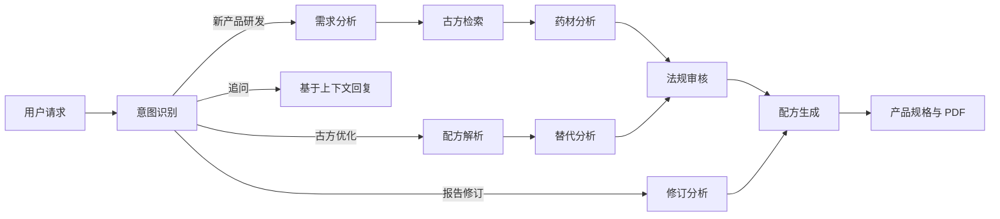

# 寿仙谷智能产品研发助手

<p align="center">
  基于 LangGraph 的中药与健康产品研发辅助系统<br />
  从需求解析、古方研究到配方设计和研发报告，展示可追踪的多智能体工作流
</p>

<p align="center">
  <a href="#功能概览">功能概览</a> ·
  <a href="#快速开始">快速开始</a> ·
  <a href="#工作流程">工作流程</a> ·
  <a href="#api">API</a>
</p>

> [!NOTE]
> 本项目生成的配方、法规分析和产品规格仅供研发参考。正式立项、功效宣称及合规判断需由相关专业人员复核。

## 功能概览

| 能力 | 说明 |
| --- | --- |
| 多路径研发流程 | 识别新产品研发、古方优化、报告修订、方案追问等请求，并选择相应的 LangGraph 流程 |
| 过程可视化 | 通过 SSE 实时展示各步骤的状态、内容及耗时，支持暂停后继续 |
| 配方编辑 | 在前端编辑配方表，进行单位归一化与用量汇总，并据此发起修订 |
| 报告与会话 | 生成 PDF 研发报告；使用 SQLite 保存对话与工作流检查点，支持历史查询、重命名和删除 |
| 可选报告上传 | 在启用对应选项并配置 DeluData 凭据后，将生成的 PDF 上传至指定资料目录 |

## 技术栈

- **后端：** Python、FastAPI、LangGraph、LangChain OpenAI 接口、SQLite、Playwright
- **前端：** Next.js 14、React 18、TypeScript、Tailwind CSS
- **模型服务：** 通过兼容 OpenAI 的接口调用 DashScope 通义千问，模型名称由环境变量配置

## 快速开始

### 前提条件

- Python 3.10+
- Node.js 18+ 与 npm
- 可用的 DashScope API Key
- Playwright Chromium（仅 PDF 导出需要）

### 1. 启动后端

在项目根目录执行：

```bash
cd backend
python -m venv .venv_local
```

激活虚拟环境：Windows PowerShell 使用 `.venv_local\Scripts\Activate.ps1`，macOS / Linux 使用 `source .venv_local/bin/activate`。

```bash
pip install -r requirements.txt
python -m playwright install chromium
```

复制 `backend/.env.example` 为 `backend/.env`，填入 `DASHSCOPE_API_KEY`。随后在 `backend/` 目录运行：

```bash
python main.py
```

后端默认监听 `http://localhost:9603`，接口文档位于 `http://localhost:9603/docs`。

### 2. 启动前端

另开终端，在项目根目录执行：

```bash
cd frontend
npm install
npm run dev -- -p 9604
```

打开 `http://localhost:9604`。仓库中的开发配置将 `/api/*` 请求转发到本机后端的 9603 端口。

Windows 用户也可以运行根目录的 `start.bat`；该脚本使用 `backend/.venv_local`，请先完成上面的依赖安装。

### 环境变量

| 变量 | 用途 |
| --- | --- |
| `DASHSCOPE_API_KEY` | 模型服务密钥，运行研发流程前必须配置 |
| `DASHSCOPE_BASE_URL` | DashScope 兼容 OpenAI 接口地址 |
| `QWEN_MODEL` | 模型名称，默认 `qwen-plus` |
| `DELUDATA_BASE_URL` | 可选报告上传服务的 API 地址 |
| `DELUDATA_TEST1_PASSWORD` | 可选报告上传功能使用的凭据 |

`backend/.env` 已被 Git 忽略。请勿把真实密钥写入 `.env.example` 或提交到仓库。DeluData 上传是可选功能，不配置时仍可生成和下载 PDF。

## 工作流程



前端提供示例场景、步骤详情、配方编辑和会话历史。模型输出会随请求及模型配置变化。

## API

后端启动后可在 `/docs` 查看交互式接口文档。

| 方法 | 路径 | 用途 |
| --- | --- | --- |
| `GET` | `/api/health` | 健康检查 |
| `POST` | `/api/chat` | 发起对话，返回 SSE 事件流 |
| `POST` | `/api/chat/resume` | 继续已暂停的会话 |
| `GET` | `/api/conversations` | 列出历史会话 |
| `GET` / `PATCH` / `DELETE` | `/api/conversations/{session_id}` | 读取、重命名或删除会话 |
| `GET` | `/api/download/{doc_id}` | 下载生成的 PDF |

例如，使用 `curl -N` 接收事件流：

```bash
curl -N -X POST http://localhost:9603/api/chat \
  -H "Content-Type: application/json" \
  -d '{"message":"设计一款以灵芝为主题的健康产品"}'
```

## 项目结构

```text
backend/
  agents/             # 路由与研发步骤
  output/             # PDF 渲染及其他文档处理模块
  main.py             # FastAPI、SSE 与会话接口
  graph.py            # LangGraph 流程
  db.py               # SQLite 数据访问
  deludata_upload.py  # 可选报告上传
frontend/
  src/app/            # 页面与 Next.js API 代理
  src/components/     # 对话、流程和配方界面
  src/lib/            # API 客户端与配方计算
start.bat             # Windows 本地启动脚本
deploy.md             # 部署记录
```

## 参与贡献

欢迎提交 Issue 或 Pull Request。提交前请检查配置文件与生成内容，确保不包含密钥、个人数据或运行时产物。
